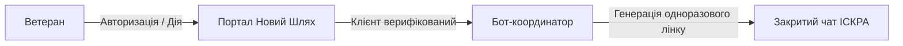

# Пропозиція про партнерство: Портал «Новий Шлях» 🤝 Чат ветеранів «ІСКРА»

**Для кого:** Адміністрація та актив осередку «Ветеранського корпусу» Черкащини (Андрій Колдов «Шрам» та команда).
**Від кого:** Координаційний центр реінтеграції ветеранів «Новий Шлях» (ГО «Талан ЮА», Тимур Шаповал).

---

## 💡 Головна ідея
Об'єднати можливості двох платформ для створення найбезпечнішого та найефективнішого ветеранського простору в Черкаській області:
* **«Новий Шлях»** виступає як **безпечний структурований вхід** (офіційна верифікація через Дія.Підпис, перевірені психологи, юристи, лікарі, освітні гранти).
* **«ІСКРА»** виступає як **живе серце спільноти** (неформальне спілкування ветеранів «свій для свого», оперативна взаємодопомога, обговорення).

---

## 🔄 Як працює інтеграція (технічна логіка)

1. **Верифікований доступ:** Ветерани проходять підтвердження статусу на порталі «Новий Шлях» (через Дія або модератора).
2. **Миттєве запрошення:** У боті «Новий Шлях» з'являється кнопка `🚨 SOS / Кризова допомога` та `💬 Спільнота`. При натисканні бот автоматично генерує унікальне одноразове посилання для вступу в чат «ІСКРА».
3. **Безпека чату:** Жодна стороння людина, спамер чи бот не зможе потрапити в «ІСКРУ», оскільки посилання згорає одразу після використання одним верифікованим ветераном.

---

## 📈 Взаємна вигода партнерства

### Що отримує чат «ІСКРА»:
* **Захист від «чужих»:** Повна впевненість у тому, що кожен новий учасник чату — реальний верифікований ветеран або член родини, який пройшов перевірку.
* **Притік активної аудиторії:** Користувачі порталу «Новий Шлях» ставатимуть учасниками вашої спільноти.
* **Зниження навантаження на актив чату:** Базові питання про пільги, контакти юристів чи пошук психологів закриває база даних порталу «Новий Шлях», звільняючи чат для живого спілкування.

### Що отримує «Новий Шлях»:
* **Соціалізація ветеранів:** Можливість направити ветерана у живе підтримуюче середовище однодумців одразу після надання первинної допомоги.
* **Швидка реакція громади:** Можливість публікувати важливі анонси та події безпосередньо в середовищі «Іскри».
